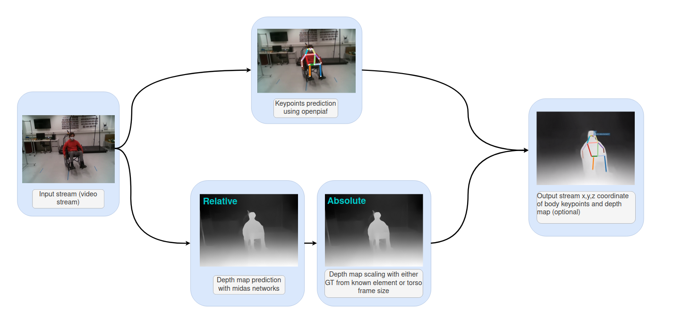

Human localization for interaction with a mobile furniture
==========================================================

This works takes as input a video/image and provide as output a json file with position in pixels and relative/absolute depth depending on the scaling mode selected. Depending on the scaling mode, ground truth may be necessary. The ground truth can be given in a json files containing one depth image array per line. 
The code necessary for it's generation from a D435i camera is provided in acquisition section.

Requirement 
===========

``pip install -r requirements.txt``

Command
=======

acquisition
-----------
An acquisition script have been created to store the mp4 video stream with the corresponding depth map from the D435i stereo camera. It store the data in 'input' file. The depth map is stored in json files with each line being an array containing the depth map.

The script is run with :

``python3 -m acquisition``

To do an acquisition please press on the 's' keyboard (for 'save')

From video files 
----------------
This files runs from video files, it will output a mp4 video providing the disparity map and keypoint location and a json text files with the keypoints and their depth for each frame.
You can provide a GT files path with the argument 'GT_depth_file' and decide to scale from 
the GT with 'shift-scale'. More option are detailled in the 'help' argument.

To run from video input, please put your input file in input and run :

.. code-block::

        python3 -m Test_from_mp4 --source=input/output1 
        --video-output=output/output.mp4 
        --video-fps=30 
        --json-output=output/json_output.json 
        --depth_model='midas' 
        --model_type='dpt_hybrid' 
        --checkpoint mobilenetv2 
        --shift-scale-from-torso 

From D435i camera 
-----------------
This script run openpifpaf and use the depth map provided by the D435i camera, it should be connected before running it.

They are some vizualisation implemented, you can acces the pointcloud view :

+-------------------------------------------------------------------------+
|  .. figure:: docs/pointcloud.png                                        |
|``python3 -m test_from_camera --plot-pointcloud --GT-from-camera``       |
+-------------------------------------------------------------------------+

+----------------------------------------------------------------------------------------------------------+
|  .. figure:: docs/pointcloud_torso_frame.png                                                             |
|  ``python3 -m test_from_camera --plot-pointcloud --GT-from-camera --project-pointcloud-torso-frame``     |
+----------------------------------------------------------------------------------------------------------+

+-------------------------------------------------------------------------+
|  .. figure:: docs/skeleton.png                                          |
|``python3 -m test_from_camera --plot-skeleton --GT-from-camera``         |
+-------------------------------------------------------------------------+

Other parameters are available and accessible with the 'help' argument

ROS2
====

First please install `ROS2<https://docs.ros.org/en/foxy/Installation.html>`_

Then run the following command : 

.. code-block::

        cd ROS2/depth_subscriber  
        colcon build --packages-select depth_subscriber  
        . install/setup.bash  
        ros2 run depth_subscriber listener  

This provide the same output as test_from_camera, however it run on ros2 and publish the pointcloud. Small edition of the depth_subscriber.py file could publish any wanted data. 
However, for some still unknown reason, this files run 2~4 time slower than the 'test_from_camera.py' file so it is best using the python script