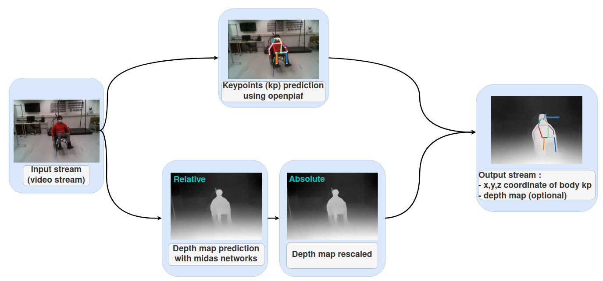

Human localization for interaction with a mobile furniture
==========================================================



As you can see the networks takes as input a video/image and provide as output a json file with position in pixels and relative/absolute depth depending on the scaling mode selected. Depending on the scaling mode, ground truth may be necessary. The ground truth can be given in a json files containing one depth image array per line. 
The code necessary for it's generation from a D435i camera is provided in acquisition folder.

Requirement 
===========

Command
=======
From video files 
----------------
To run from video input, please put your input file in input and run :

```
python3 -m Test --source=input/wheelchair2 \
--video-output=output/output.mp4 \
--video-fps=30 \
--json-output=output/json_output.json \
--depth_model='midas' \
--model_type='dpt_hybrid' \
--checkpoint mobilenetv2 \
--shift-scale-from-torso \
--GT_depth_file=/input/data2.json
```

You can also provide a GT files path with the argument 'GT_depth_file' and decide to scale from 
the GT with 'shift-scale'. More option are detailled in the 'help' argument.

It will output a mp4 video providing the disparity map and keypoint location and a json text files with the keypoints and their depth for each frame.

From D435i camera 
-----------------
This script run openpifpaf and use the depth map provided by the D435i camera, it should be connected before running it.

They are some vizualisation implemented, you can acces the pointcloud view :

+-------------------------------------------------------------------------+
|  .. figure:: docs/pointcloud.png                                        |
|```python3 -m test_from_camera --plot-pointcloud --GT-from-camera```     |
+-------------------------------------------------------------------------+

+----------------------------------------------------------------------------------------------------------+
|  .. figure:: docs/pointcloud_torso_frame.png                                                             |
|```python3 -m test_from_camera --plot-pointcloud --GT-from-camera --project-pointcloud-torso-frame```     |
+----------------------------------------------------------------------------------------------------------+

+-------------------------------------------------------------------------+
|  .. figure:: docs/skeleton.png                                          |
|```python3 -m test_from_camera --plot-pointcloud --GT-from-camera```     |
+-------------------------------------------------------------------------+